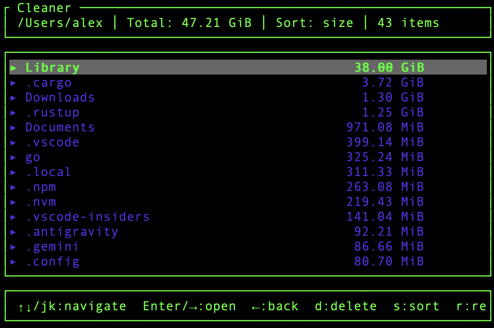

# Cleaner

[](https://github.com/vyrti/cleaner/actions/workflows/build.yml)
[](https://github.com/vyrti/cleaner/actions/workflows/release.yml)
[](LICENSE)

**Ultra-fast parallel scanner and cleaner for development temp files.** Instantly finds and removes `.terraform`, `target`, `node_modules`, `__pycache__`, and other build artifacts across your entire drive. Optional ncdu-style TUI for interactive browsing.



## Features

- **Ultra-Fast** - Parallel scanning with [jwalk](https://crates.io/crates/jwalk) + [rayon](https://crates.io/crates/rayon) uses all CPU cores
- **Smart Deletion** - Finds and removes common dev artifacts: `node_modules`, `.terraform`, `target`, `__pycache__`, etc.
- **Optional TUI** - ncdu-style interactive browser with instant navigation (`-i` flag)
- **Configurable** - TOML config + environment variables
- **Safe** - Dry-run mode and time-based filtering (`--days`)
- **Cross-platform** - Windows, Linux, macOS, FreeBSD | ARM64 and x64

## Optimizations

- **Parallel Scanning**: Uses `jwalk` and `rayon` to utilize all CPU cores for directory traversal.
- **macOS Docker Fix**: Automatically detects and excludes `~/Library/Containers/com.docker.docker` to prevent inflated size reporting (Docker sparse image issue).
- **Protected Directories**: Never scans or cleans critical toolchain directories in NON tui mode:
  - `~/.cargo`, `~/.rustup` (Rust)
  - `~/go`, `~/.go` (Go)
  - `~/.npm`, `~/.nvm` (Node.js)
  - `~/.pyenv`, `~/.rbenv` (Python/Ruby)
  - `~/.gradle`, `~/.m2` (Java)
  - `~/.local`, `~/.config`, `~/.ssh`, `~/.gnupg`, `~/Library`


## Installation

### From Releases

Download the latest binary from [Releases](https://github.com/vyrti/cleaner/releases).

### From Source

```bash
cargo install --git https://github.com/vyrti/cleaner
```

### Docker

```bash
docker pull ghcr.io/vyrti/cleaner:latest
```

## Usage

```bash
# Quick scan and delete (defaults to home directory)
cleaner

# Scan specific folder
cleaner ~/Projects

# Preview what would be deleted (safe)
cleaner ~/Projects --dry-run

# Filter by age (only delete items older than 7 days)
cleaner ~/Projects --days 7

# Interactive TUI mode (optional - for browsing)
cleaner -i
cleaner -i ~/Projects
```

### Options

| Flag | Description |
|------|-------------|
| `[PATH]` | Target folder to scan (positional, defaults to home directory) |
| `-i, --interactive` | **Optional** interactive TUI mode for browsing |
| `-d, --dry-run` | Preview without deleting |
| `-v, --verbose` | Show all matched paths |
| `-f, --folder` | Target folder to scan (alternative to positional) |
| `-c, --config` | Path to TOML config file |
| `-j, --threads` | Number of threads (default: CPU cores) |
| `--days` | Only delete items older than N days |

## Configuration

### Config File

Create `cleaner.toml`:

```toml
[patterns]
directories = [
    ".terraform",
    "target",
    "node_modules",
    "__pycache__",
]

files = [
    ".DS_Store",
    "*.pyc",
]

# Optional: Only delete items older than 30 days
days = 30
```

See [cleaner.toml.example](cleaner.toml.example) for all defaults.

### Environment Variables

Override config with environment variables:

```bash
CLEANER_DIRS=".terraform,target" cleaner -f ~/Projects
CLEANER_FILES=".DS_Store,*.pyc" cleaner -f ~/Projects
```

**Priority:** Environment variables > Config file > Defaults

## Default Patterns

### Directories
`.terraform`, `target`, `node_modules`, `__pycache__`, `.pytest_cache`, `.mypy_cache`, `.tox`, `.ruff_cache`, `venv`, `.venv`, `.eggs`, `*.egg-info`, `dist`, `build`, `.next`, `.nuxt`, `.turbo`, `.gradle`, `coverage`, `.coverage`, `htmlcov`, `.cache`, `.parcel-cache`

### Files
`.pyc`, `.pyo`, `.pyd`, `.DS_Store`, `Thumbs.db`, `desktop.ini`, `.swp`, `.swo`, `~`

## Docker Usage

```bash
# Mount directory and run
docker run -v /path/to/scan:/data ghcr.io/vyrti/cleaner -f /data --dry-run

# With env vars
docker run -e CLEANER_DIRS=".terraform,target" -v /path:/data ghcr.io/vyrti/cleaner -f /data
```

## License

[Apache 2.0](LICENSE)
