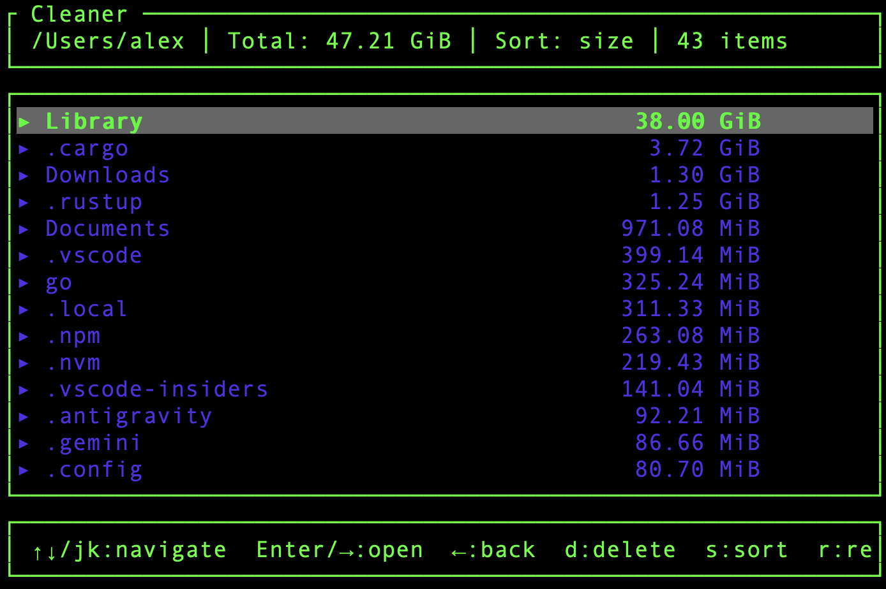

# Cleaner

[](https://github.com/vyrti/cleaner/actions/workflows/build.yml)
[](https://github.com/vyrti/cleaner/actions/workflows/release.yml)
[](#license)

> [!WARNING]
> **Disclaimer**: Use this application at your own risk. The authors and contributors are not responsible for any data loss, system configuration breakage, or other damages resulting from the use of this software. Always double-check what is being deleted before executing manual deletions (see [Safety & System Protection](#safety--system-protection) for details).

**Ultra-fast parallel disk analyzer and scanner** ncdu-style TUI for interactive browsing.



## Features

- **Ultra-Fast** - Parallel scanning uses all CPU cores and written in Rust (3x faster than Go-based `gdu` on 250gb+ drives)
- **Smart Deletion** - Finds and removes common dev artifacts: `node_modules`, `.terraform`, `target`, `__pycache__`, etc.
- **Configurable** - TOML config + environment variables
- **Safe** - Dry-run mode and time-based filtering (`--days`)
- **Persistent macOS Index** - Optional instant warm-start TUI browsing with safe FSEvents catch-up between launches
- **Cross-platform** - Windows, Linux, macOS, FreeBSD | ARM64 and x64

## Optimizations

- **Parallel Scanning**: Uses `rayon` to utilize all CPU cores for directory traversal.
- **Performance Advantage**: Nearly **3x faster** than `gdu` on full disk scans due to platform-native directory traversal (such as batch `getattrlistbulk` on macOS).
- **macOS Docker Fix**: Automatically detects and excludes `~/Library/Containers/com.docker.docker` to prevent inflated size reporting (Docker sparse image issue).
- **Protected Directories**: Never cleans critical toolchain directories:
  - `~/.cargo`, `~/.rustup` (Rust)
  - `~/go`, `~/.go` (Go)
  - `~/.npm`, `~/.nvm` (Node.js)
  - `~/.pyenv`, `~/.rbenv` (Python/Ruby)
  - `~/.gradle`, `~/.m2` (Java)
  - `~/.local`, `~/.config`, `~/.ssh`, `~/.gnupg`, `~/Library`


## Installation

### From Releases

Download the latest binary from [Releases](https://github.com/vyrti/cleaner/releases).

### From Source

```bash
cargo install --git https://github.com/vyrti/cleaner
```

### Docker

```bash
docker pull ghcr.io/vyrti/cleaner:latest
```

## Usage

By default, running `cleaner` (with or without a path argument) launches the interactive TUI mode (no files are deleted automatically). 

To run in non-interactive CLI scripting/devops mode, you must explicitly pass `--json` (which runs in dry-run mode by default) or `-y`/`--confirm` (which executes live deletions).

```bash
# Launch interactive TUI mode starting in the home directory
cleaner

# Launch interactive TUI mode starting in a specific folder
cleaner ~/Projects

# macOS only: persist the TUI tree for fast subsequent launches
cleaner ~/Projects --index

# macOS only: discard the cached generation and perform a new exact scan
cleaner ~/Projects --rebuild-index

# Run non-interactive CLI scripting mode and delete matching files (requires --confirm)
cleaner ~/Projects --confirm

# Scripting/DevOps mode: output structured JSON (dry-run by default)
cleaner ~/Projects --json

# Scripting/DevOps mode: output structured JSON and delete matching files
cleaner ~/Projects --json --confirm

# Filter by age (only delete items older than 7 days)
cleaner ~/Projects --confirm --days 7
```

### Options

| Flag | Description |
|------|-------------|
| `[PATH]` | Target folder to scan (positional). If omitted, defaults to home directory. |
| `-y, --confirm` | Confirm deletion (live run) - actually delete files instead of dry-run (forces CLI mode) |
| `-v, --verbose` | Show all matched paths |
| `-f, --folder` | Target folder to scan (alternative to positional) |
| `-c, --config` | Path to TOML config file |
| `-j, --threads` | Number of threads (default: CPU cores) |
| `--days` | Only delete items older than N days |
| `--json` | Output results in JSON format (forces CLI mode) |
| `--force` | Disable system directory protections (allow automated cleaning inside protected paths) |
| `--index` | macOS TUI only: enable the persistent filesystem index |
| `--rebuild-index` | macOS TUI only: force an exact scan and replace the index; implies `--index` |

## Persistent macOS TUI Index

Persistent indexing is opt-in and is available only in the interactive macOS TUI. It does not install a daemon or background service.

```bash
# First run: exact scan, followed by asynchronous index persistence
cleaner ~/Projects --index

# Later runs: show the cached tree immediately, then synchronize it
cleaner ~/Projects --index

# Force a fresh exact scan if desired
cleaner ~/Projects --rebuild-index
```

The first indexed run uses the same exact filesystem scanner as normal TUI mode. Once the tree is available, Cleaner writes a crash-safe redb generation in the background. Subsequent runs load that tree immediately and replay macOS FSEvents history recorded between launches. Event paths are only hints: Cleaner re-reads affected directories before updating the index.

While a cached tree is catching up, the footer shows `Index: syncing; browsing only`. Navigation and sorting remain available, but cleaning and manual deletion are disabled. They are enabled only after reconciliation completes and the footer changes to `Index: ready`.

Safety and recovery behavior:

- TUI Clean always uses the fresh scanner/deleter pipeline; cached entries are never deletion candidates.
- Manual deletion re-reads metadata without following symlinks and rejects missing paths, symlinks, or paths whose type changed after scanning.
- Pressing `r` still performs an exact refresh and writes a new index generation.
- Dropped or unusable FSEvents history, volume changes, incompatible data, corruption, and index-writer contention fall back to an exact scan.
- Configuration changes reclassify cached names without requiring another filesystem traversal.
- The cache is stored at `~/Library/Caches/cleaner/index-v1.redb` and keeps independent generations for different canonical scan roots.

`--index` and `--rebuild-index` cannot be combined with CLI modes such as `--json` or `--confirm`. On Linux, Windows, and FreeBSD these flags are rejected; normal CLI and TUI behavior is unchanged.

## Safety & System Protection

To protect system integrity, shell configurations, developer toolchains, and package managers (such as the Cargo environment or IDE files like Antigravity IDE), `cleaner` implements strict cross-platform safety rules for automated cleaning:

1. **Auto-Clean Exclusions**: Any matching files or folders located inside protected directories are automatically ignored by automated cleaning features (e.g., TUI Clean-All via the `c` key, or CLI non-interactive cleanups). They are never flagged as temporary targets.
2. **Protected Locations**:
   - **macOS & Linux**: `/System`, `/Library`, `/Applications`, `/usr`, `/var`, `/etc`, `/bin`, `/sbin`, `/lib`, `/lib64`, `/boot`, `/opt`, `/private`, `/dev`, `/proc`, `/sys`, `/run`, and user-profile paths (like `~/.config`, `~/.local`, `~/.cargo`, `~/.rustup`, `~/.npm`, `~/.ssh`, `~/.gnupg`, and `~/Library`).
   - **Windows**: `%SystemRoot%` (`C:\Windows`), `%ProgramFiles%` (`C:\Program Files`), `%ProgramFiles(x86)%` (`C:\Program Files (x86)`), `%ProgramData%` (`C:\ProgramData`), `C:\System Volume Information`, and the user's `AppData` directory.
3. **Manual Override**: These protected system areas remain fully traversable in the TUI browser so you can inspect them. If you explicitly wish to delete an item, you can select it and press the Delete key (`d`) to invoke manual deletion with confirmation.
4. **Force Cleanup**: If you need to perform automated cleanup inside protected system directories (e.g., `cleaner /usr/local/Projects`), you must explicitly pass the `--force` flag. This disables the protection exclusions, allowing autoclean to target temp paths anywhere.

## Configuration

### Config File

Create `cleaner.toml`:

```toml
[patterns]
directories = [
    ".terraform",
    "target",
    "node_modules",
    "__pycache__",
]

files = [
    ".DS_Store",
    "*.pyc",
]

# Optional: Only delete items older than 30 days
days = 30
```

See [cleaner.toml.example](cleaner.toml.example) for all defaults.

### Environment Variables

Override config with environment variables:

```bash
CLEANER_DIRS=".terraform,target" cleaner -f ~/Projects
CLEANER_FILES=".DS_Store,*.pyc" cleaner -f ~/Projects
```

**Priority:** Environment variables > Config file > Defaults

## Default Patterns

### Directories
`.terraform`, `target`, `node_modules`, `__pycache__`, `.pytest_cache`, `.mypy_cache`, `.tox`, `.ruff_cache`, `venv`, `.venv`, `.eggs`, `*.egg-info`, `dist`, `build`, `.next`, `.nuxt`, `.turbo`, `.gradle`, `coverage`, `.coverage`, `htmlcov`, `.cache`, `.parcel-cache`

### Files
`.pyc`, `.pyo`, `.pyd`, `.DS_Store`, `Thumbs.db`, `desktop.ini`, `.swp`, `.swo`, `~`

## Docker Usage

```bash
# Mount directory and run
docker run -v /path/to/scan:/data ghcr.io/vyrti/cleaner -f /data --dry-run

# With env vars
docker run -e CLEANER_DIRS=".terraform,target" -v /path:/data ghcr.io/vyrti/cleaner -f /data
```

## macOS Disk Space Discrepancy

When running the interactive TUI on macOS, you may notice a difference between the size of the scanned directory tree (indicated by **Folder**) and the total filesystem space reported by **Disk Used**. This is expected due to the following macOS behaviors:

1. **Binary vs. Decimal Units**: macOS Finder and System Settings display disk space in decimal GB ($1000^3$ bytes). The TUI uses binary GiB ($1024^3$ bytes). For a $220\text{ GB}$ disk, the base-2 unit conversion alone accounts for a **$15\text{ GiB}$** difference ($220\text{ GB} \approx 205\text{ GiB}$).
2. **APFS Container Sharing**: Under Apple File System (APFS), all volumes in the same container pool (e.g., `System`, `Data`, `VM/Swap`, and `Recovery`) share the same physical storage pool. The `Disk Used` stat queries the shared container level, which includes system files and virtual memory swap space that are not part of your local scanned data.
3. **System Integrity Protection (SIP) & Permissions**: macOS blocks applications from inspecting system-managed caches, VM swap space, and protected user folders (like `/private/var/folders/` or `/System/Library/`) even when running as `root` unless Full Disk Access is explicitly granted to the Terminal app. Scans will skip these directories, meaning they are excluded from the calculated `Folder` size but still counted under `Disk Used`.

## macOS Root-Scan Performance

Native release profiling against `/` on an Apple Silicon MacBook Air covered about 360,000
directories and 1.14 million files. The initial four-worker scan took about 7.81 seconds. A worker
sweep measured 26.9 seconds with one worker, 13.5 seconds with two, 7.67 seconds with four, 6.01
seconds with six, and 6.19 seconds with eight. Cleaner therefore uses all macOS performance cores
plus half of the remaining efficiency cores by default.

The post-change root scan takes about 5.85 seconds: approximately 5.68 seconds for exact filesystem
traversal/indexing, 146 ms for sizing, and 21 ms for finalization. Root-volume traversal uses parent
directory descriptors and `openat` to reduce repeated full-path resolution; shallower scans retain
the faster absolute-path implementation. Retained tree values are produced directly, avoiding a
second 360,000-entry map conversion and peak-memory overlap.

Native sampling shows that the remaining scan time is overwhelmingly inside macOS `open` and
`getattrlistbulk`. Apple requires opening each traversed directory and calling `getattrlistbulk`
until it returns zero; skipping either would make the report incomplete. Tests with 64, 256, and
1024 KiB bulk buffers were equivalent within run-to-run noise, so Cleaner uses 64 KiB per worker.

## Third-Party Code

This software integrates code adapted from [getattrlistbulk-rs](https://github.com/quivent/getattrlistbulk-rs), which is dual-licensed under the MIT and Apache 2.0 licenses.

## License

Dual-licensed under either:

* Apache License, Version 2.0 ([LICENSE-APACHE](LICENSE-APACHE))
* MIT license ([LICENSE-MIT](LICENSE-MIT))
